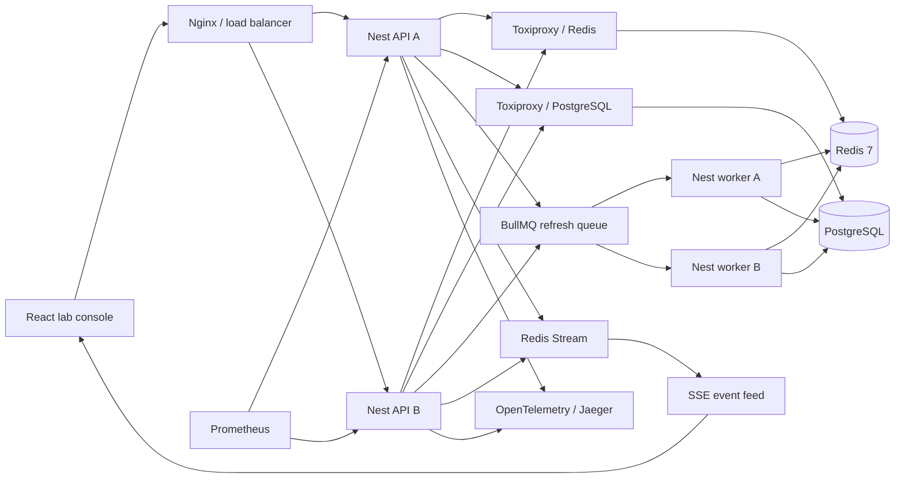

# Distributed Cache Lab

An interactive, production-shaped lab for exploring distributed caching behavior rather than watching canned animations. The React console drives two load-balanced NestJS API replicas, two BullMQ workers, PostgreSQL, and a single Redis 7 node. Every cache hit, miss, stale response, eviction, coalesced request, write, and injected fault comes from the running system.


## Run it

Requirements: Docker with Compose v2. No local Node installation is needed.

```bash
docker compose up --build --wait
```

Open:

- Lab console: <http://localhost:5175>
- Swagger API: <http://localhost:5175/api/docs>
- Prometheus: <http://localhost:19090>
- Jaeger: <http://localhost:16686>

Stop the lab with `docker compose down`. Add `-v` if you also want to remove the PostgreSQL volume.

## What to try

1. Flush the cache, read `product:42` twice, and compare `MISS` with `HIT`.
2. Flush, then send a 16-request burst to `catalog:home`. The distributed lock should collapse origin reads across both API replicas.
3. Read `product:404` twice to see a miss followed by a negative-cache hit.
4. Advance the shared clock beyond the soft TTL. With stale-while-revalidate enabled, the request returns stale data while a deduplicated BullMQ job refreshes it.
5. Reduce capacity and switch between exact application-managed LRU and LFU eviction.
6. Mutate `pricing:pro`. PostgreSQL commits the resource and an outbox event in one transaction; a worker then applies invalidate or write-through reconciliation.
7. Enable Redis outage. Per-replica circuit breakers open and reads bypass the cache instead of failing the request.
8. Enable slow origin and inspect latency in the trace, Prometheus, and Jaeger.

The API also exposes normal cache diagnostics: `Cache-Status`, `Age`, `ETag`, `Server-Timing`, `X-Cache-Result`, and `X-Instance-Id`.

## Architecture



The bounded cache is deliberately implemented above Redis instead of relying on Redis server eviction. Lua scripts atomically maintain the entry index and exact LRU/LFU metadata; Redis itself runs with `noeviction`. See [docs/architecture.md](docs/architecture.md) for the request, refresh, and write paths.

## Commands

```bash
npm ci
npm run lint
npm run typecheck
npm test

# Requires Redis and PostgreSQL (the shown ports match the Compose stack)
RUN_INTEGRATION=true RUN_OUTBOX_INTEGRATION=true \
  TEST_REDIS_PORT=16379 TEST_DB_PORT=15432 npm run test:integration

# Requires the full Compose stack
npm run test:e2e:outbox
npm run test:e2e

# Requires k6 and the full Compose stack
npm run load
```

## Scope

This repository is an executable systems-design demonstration, not a Redis client tutorial. Its fixed resources and small capacity make cache state visually legible while the concurrency, locking, queueing, outbox, telemetry, and failure behavior remain real.

The Compose topology intentionally uses a single Redis node. That keeps replication and cluster failover from obscuring the cache-policy experiments. The API and worker tiers still have multiple replicas, which is exactly where cross-instance locking, job deduplication, shared state, and idempotency become observable. See [docs/production-delta.md](docs/production-delta.md) before treating the topology as a deployment template.

## License

MIT
