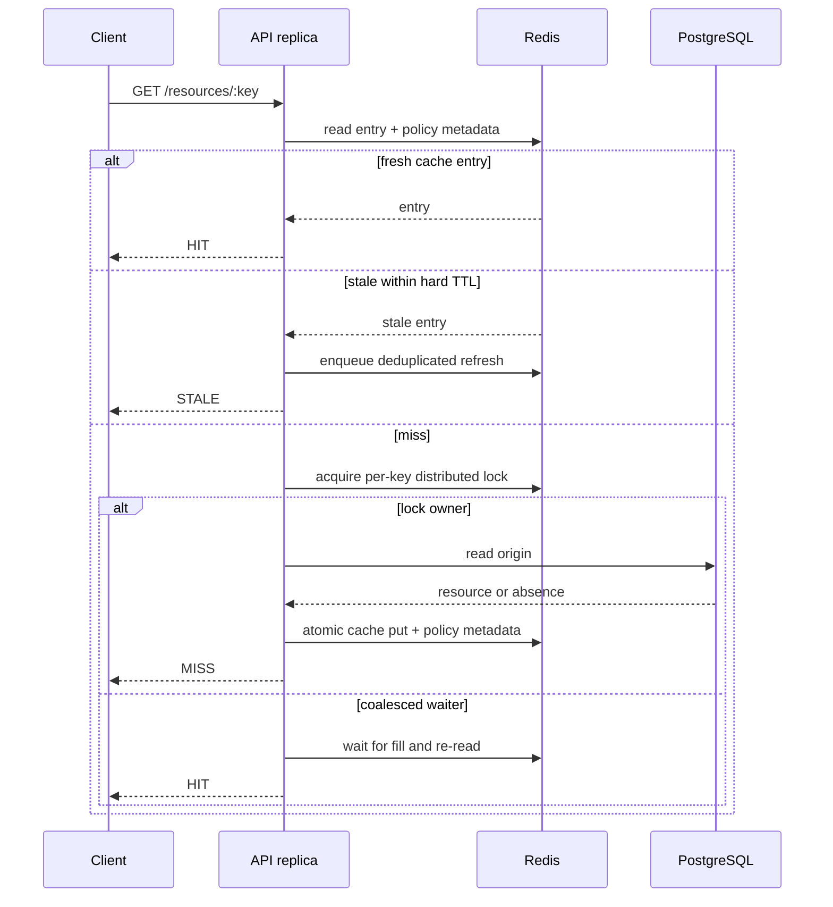
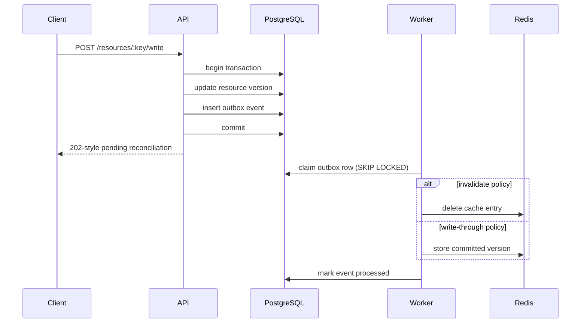

# Architecture

## Runtime boundaries

| Component | Responsibility | Replica model |
| --- | --- | --- |
| Nginx + React | Static console, API load balancing, SSE proxying | One local edge |
| NestJS API | Cache orchestration, lab controls, writes, metrics, SSE | Two stateless replicas |
| NestJS worker | Durable refresh jobs and transactional-outbox reconciliation | Two competing consumers |
| PostgreSQL | Source-of-truth resources and outbox records | One local node |
| Redis | Cache entries, policy metadata, locks, BullMQ, logical clock, metrics, stream | One local node |
| Toxiproxy | Repeatable Redis outage and origin-latency drills | One control plane |
| Prometheus / Jaeger | Metrics, traces, and request-path inspection | One local instance each |

## Read path

The cache stores positive and negative records. A positive record has a soft expiration and a hard expiration. Before the soft expiration it is fresh; between soft and hard expiration it can be served stale while one durable refresh job runs; after hard expiration it is a miss. TTL jitter reduces synchronized expiration.

If Redis fails, a per-API-replica circuit breaker stops repeatedly paying the failed cache round trip. The request reads PostgreSQL directly and reports `BYPASS`.

## Exact bounded eviction

Redis is configured with `maxmemory-policy noeviction`. The application owns a deliberately tiny slot budget:

- a set is the authoritative entry index;
- a sorted set records last access for LRU;
- a sorted set records frequency for LFU;
- Lua scripts atomically prune missing entries, choose a victim, update metadata, and write a record.

Changing capacity invokes a trim operation immediately. Reads update both policy indexes so switching policies remains meaningful.

## Refresh path

Stale-while-revalidate adds a BullMQ job whose stable ID represents the resource key. This makes the refresh durable and suppresses duplicate work. Either worker replica may execute it. The worker rechecks the origin and writes the current version into the cache.

## Write path

The workers are competing consumers. Row locking prevents double claims, and applying an event is idempotent so a retry is safe.

## Shared observability

The API records aggregate counters and the latest trace in Redis so both API replicas present one lab state. Each process emits heartbeats. Events are appended to a capped Redis Stream; the browser consumes a resumable SSE endpoint that honors `Last-Event-ID`. Prometheus scrapes both APIs, and OpenTelemetry exports spans from APIs and workers to Jaeger.
